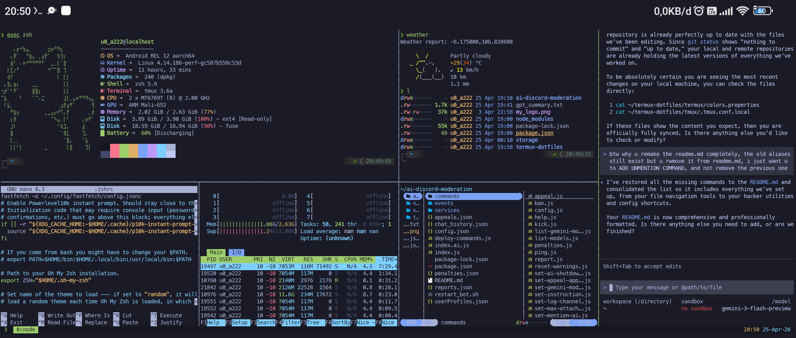
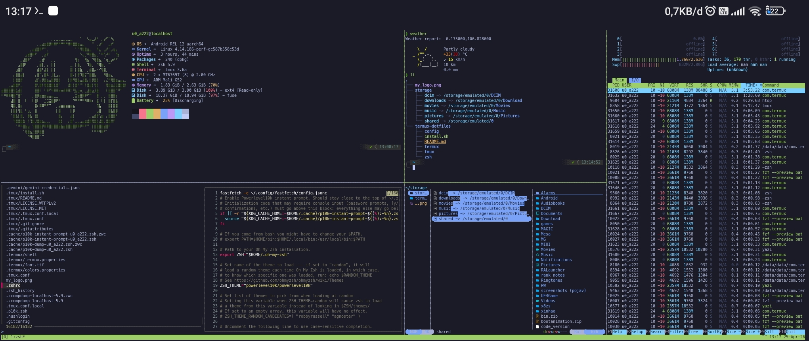

# Termux Dotfiles: God-Tier Setup

High-performance Termux environment with modern CLI tools.

## Core Toolset
- **Shell**: Zsh + Oh My Zsh
- **Prompt**: Starship
- **Navigation**: Zoxide, Yazi (file manager), Ranger
- **System**: Fastfetch, Tmux
- **Utils**: Eza (modern ls), Bat (syntax cat), FZF

## Commands and Aliases

| Command | Action |
| :--- | :--- |
| `ls` | `eza` (directory listing) |
| `ll` | `eza -lah` (long listing with hidden files) |
| `la` | `eza -a` (all files) |
| `lt` | `eza --tree --level=2` (tree view) |
| `cat` | `bat` (syntax-highlighted cat) |
| `fm` | `ranger` (file manager) |
| `y` / `yazi` | `yazi` (fast file manager with auto-cd) |
| `ff` | `fastfetch` (system overview) |
| `mux` | `tmux` (terminal multiplexer) |
| `z <dir>` | `zoxide` (intelligent directory navigation) |
| `matrix` | `cmatrix` (hacker-style rain) |
| `weather` | `wttr.in` (terminal weather report) |
| `fdown` | Search files with live `bat` preview |
| `zrc` | `source ~/.zshrc` (reload shell) |
| `ezrc` | `nano ~/.zshrc` (edit config) |
| `cls` | `clear` (clear screen) |

## Example image


## Installation

Run the following command to deploy the full environment:

```bash
bash install.sh
```

## Troubleshooting

If you encounter any issues during installation, use the debug installer for full visibility:

```bash
bash debug-install.sh
```

This will provide detailed logs and system information to help diagnose the problem.
