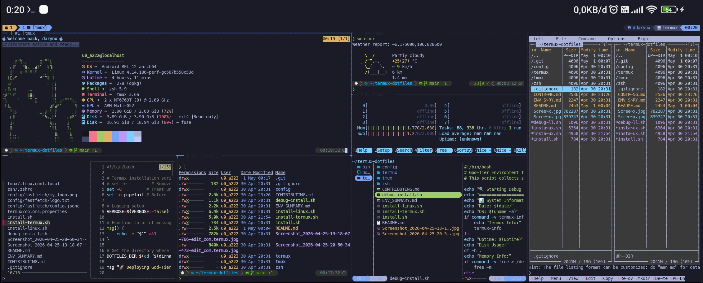

# Termux Dotfiles: Davidf's Personal Setup

A modern, fast, and good-looking Termux environment. This setup is built for productivity and aesthetics, focusing on a clean CLI experience.

## Example Preview




## What's inside?
- **Shell**: `zsh` with Oh My Zsh.
- **Theme**: Powerlevel10k (the one with all the cool icons).
- **File Managers**: `yazi` (super fast) and `ranger` (classic).
- **Multiplexer**: `tmux` with a custom Tokyo Night theme.
- **Modern Tools**: `eza` for listing files, `bat` for reading them, and `zoxide` to jump around directories instantly.

## Cool Features
- **Dynamic Identity**: Change your CLI name anytime with the `setname` command. It updates your greeting, Fastfetch, and Tmux status bar all at once.
- **Fast Navigation**: Use `y` to open the Yazi file manager. When you quit, you'll automatically `cd` into the last folder you were looking at.
- **Fancy Status**: A custom Tokyo Night Tmux bar with Powerline symbols and floating pane titles.
- **Smart Clear**: The `cls` (or `clear`) command doesn't just empty the screen—it gives you a fresh greeting and system overview.

## Commands and Aliases

| Command | Action |
| :--- | :--- |
| `ls` | `eza` (modern directory listing) |
| `ll` | `eza -lah` (long listing with hidden files) |
| `la` | `eza -a` (all files) |
| `lt` | `eza --tree --level=2` (tree view) |
| `cat` | `bat` (syntax-highlighted preview) |
| `fm` | `ranger` (classic file manager) |
| `y` / `yazi` | `yazi` (fast file manager with auto-cd) |
| `ff` | `fastfetch` (system overview) |
| `mux` | `tmux` (start/attach multiplexer) |
| `z <dir>` | `zoxide` (intelligent navigation) |
| `matrix` | `cmatrix` (hacker-style rain) |
| `weather` | `wttr.in` (terminal weather report) |
| `fdown` | Search files with live `bat` preview |
| `setname` | Update your display name everywhere |
| `zrc` | `source ~/.zshrc` (reload shell) |
| `ezrc` | `nano ~/.zshrc` (edit config) |
| `cls` | `clear` (clear screen + greeting) |

## How to Install
Just run the main installer and let it do its thing:
```bash
bash install.sh
```

*Note: Make sure to use a Nerd Font (like MesloLGS NF) in your terminal settings so all the icons show up correctly!*

## Troubleshooting
If something breaks during installation, use the debug script:
```bash
bash debug-install.sh
```
